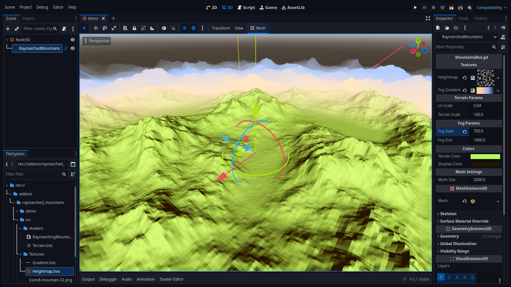
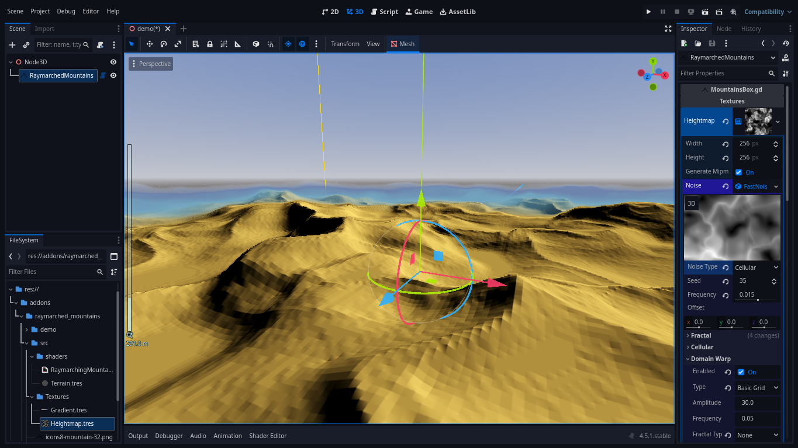
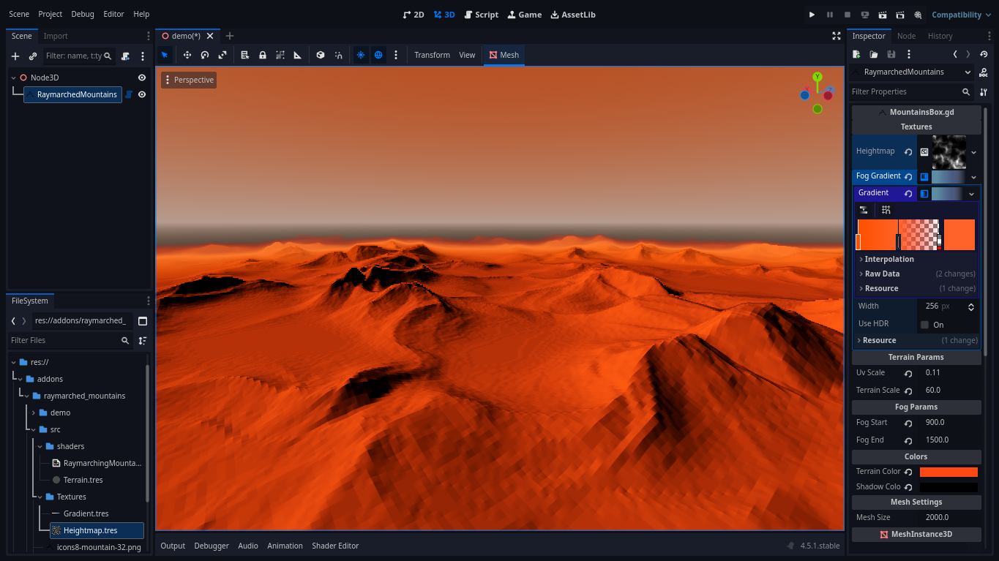
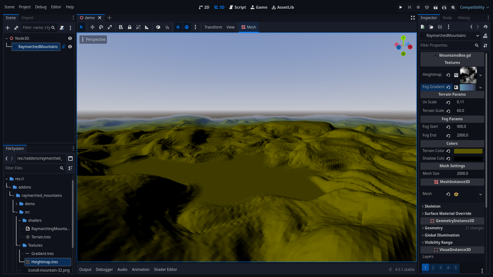

# Raymarching Mountains for Godot

A fast, powerful, and optimized plugin for creating procedural background mountains using RayMarching.

 

|  | |
|:---:|:---:|
|  |  |  

## What is it?
This addon is designed to create open worlds and eliminate the ugly "world break" effect. It generates a procedural horizon to surround your play area, making your world feel infinite without the performance cost of generating actual geometry for distant terrain.

It uses a **Raymarching Shader** applied to a flipped box mesh (similar to a skybox) to render mountains efficiently.

---

## ✨ Features
*   **Procedural Generation:** Uses noise textures to generate infinite variations.
*   **Highly Optimized:** Renders on a single mesh (**12 tris**) using shader magic. Runs at a **stable 60 fps** on old videocard *AMD Radeon HD 8600/8700M* (Integrated)
*   **Seamless Blending:** Built-in fog gradient support to blend the mountains into your sky.
*   **Customizable:** Full control over colors, scale, and fog depth.

---

## 📦 Installation
1.  Download the repository.
2.  Copy the `addons/raymarched_mountains` folder into your project's `addons/` directory.
3.  Enable the plugin in **Project > Project Settings > Plugins** (if applicable), or simply instantiate the node.

---

## ️📝 Usage
This addon is designed for ease of use.

1.  Add the **RaymarchedMountains** node to your scene.
2.  The node will automatically generate a box mesh around the center.
3.  Adjust the parameters in the Inspector to fit your art style.

---

## ⚙️ Configuration

### Textures
*   **Heightmap:** The noise texture used to generate the mountains.
    *   *Tip:* Use a `NoiseTexture2D` with "Seamless" enabled for the best results.
*   **FogGradient:** A `GradientTexture1D`. Use the alpha channel to control how the terrain fades into the sky at a distance.

### Terrain Params
*   **UV Scale:** Controls the frequency of the noise (how "busy" the mountains look). Lower values = larger features.
*   **Terrain Scale:** Controls the vertical height intensity of the mountains.

### Fog Params
*   **Fog Start:** The distance from the center where the fog begins to obscure the mountains.
*   **Fog End:** The distance where the mountains become completely invisible (fully blended with the sky).

### Colors
*   **Terrain Color:** The base color of the mountain peaks/lit areas.
*   **Shadow Color:** The color of the crevices and shadowed areas.

### Mesh Settings
*   **Mesh Size:** The size of the bounding box. Increase this if you need the mountains to be further away from the player.

---

## 📄 License
This addon is distributed under the **Creative Commons Zero (CC0)** license. You can use it in any of your projects (commercial or non-commercial) without attribution.

---

## ❤️ Support

If you find this plugin useful, please give it a star on GitHub!

*   **GitHub:** [EmberNoGlow](https://github.com/EmberNoGlow)
*   **Dev.to:** [embernoglow](https://dev.to/embernoglow)
*   **Bluesky:** [@embernoglow.bsky.social](https://bsky.app/profile/embernoglow.bsky.social)
